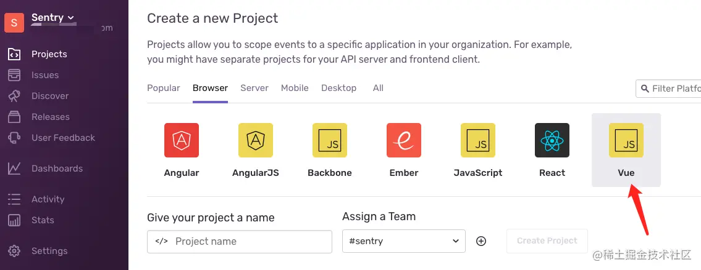
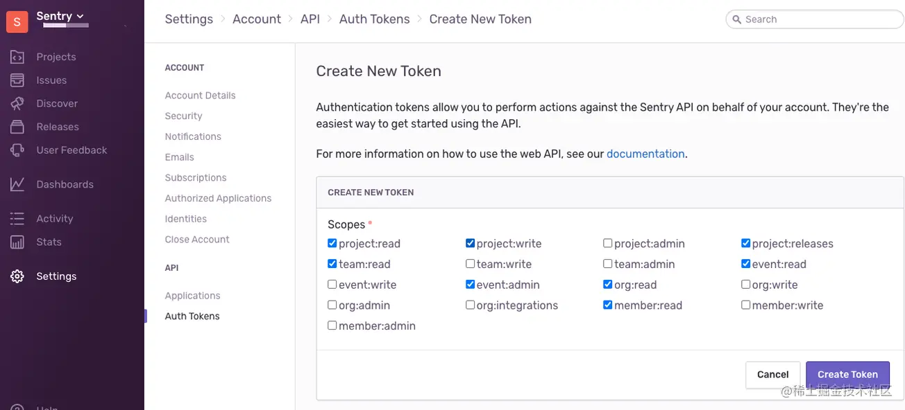
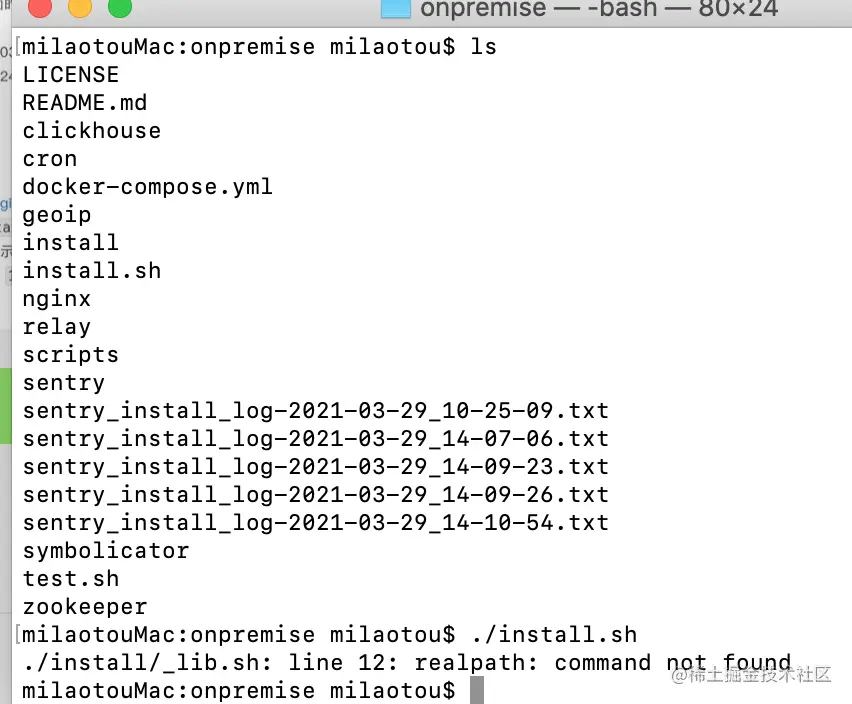
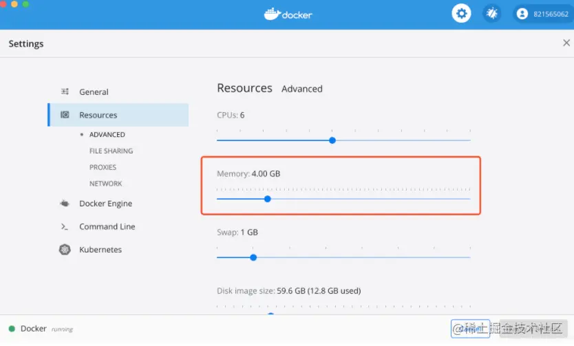
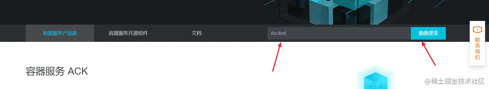
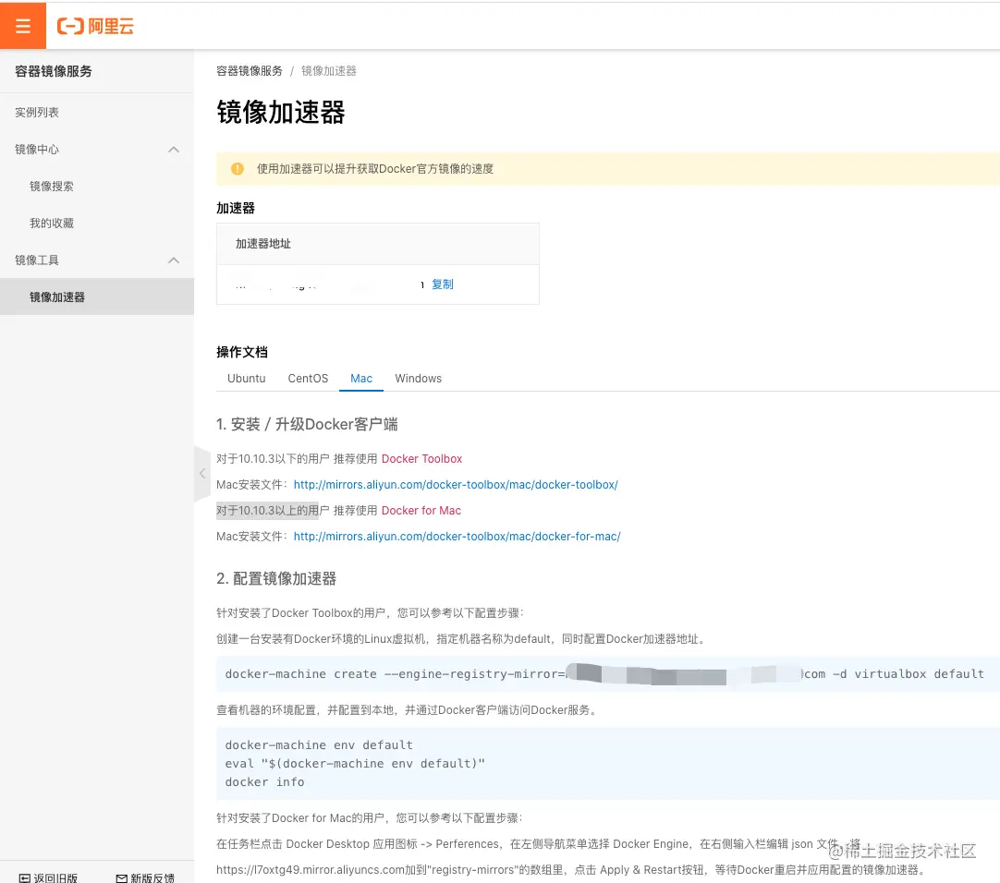

# 搭建 sentry 前端异常日志监控环境

## 一、sentry 可以做什么

可以实时监控生产环境上的系统运行状态，一旦发生异常会第一时间把报错的路由路径、错误所在文件等详细信息以邮件形式通知我们，并且利用错误信息的堆栈跟踪快速定位到需要处理的问题。

### 优点：

支持几乎所有主流开发语言( JS/Java/Python/php )和平台, 并提供了 web 界面来展示输出错误。Sentry 分为服务端和客户端 SDK，前者可以直接使用它家提供的在线服务，也可以本地自行搭建；后者提供了对多种主流语言和框架的支持，包括 React、Angular、Node、Django、RoR、PHP、Laravel、Android、.NET、JAVA 等。同时它可提供了和其他流行服务集成的方案，例如 GitHub、GitLab、bitbuck、heroku、slack、Trello 等。
支持 SourceMap，可以在生产环境查看

### 官网：

官网：[sentry.io/](https://sentry.io/)

### 安装环境要求：

-   Docker 19.03.6+

-   Compose 1.24.1+

-   4 CPU Cores

-   8 GB RAM

-   20 GB Free Disk Space

官网自行搭建说明：[develop.sentry.dev/self-hosted…](https://develop.sentry.dev/self-hosted/)

## 二、mac 搭建步骤

### 1、Docker 安装  

mac 安装地址[mirrors.aliyun.com/docker-tool…](http://mirrors.aliyun.com/docker-toolbox/mac/docker-for-mac/)

### 1、使用官方 git 仓库地址一键生成

```sh
git clone https://github.com/getsentry/onpremise.git
cd onpremise
./install.sh
```

### 2、中间过程特别慢，期间遇到的坑放在下面

配置客户端的账号和密码，之后运行如下命令，运行成功后则配置完成

```sh
docker-comose up -d
```

### 3、打开本地地址  

http://localhost:9000 用刚才配置的客户端账号和密码登录

## 三、搭建一个 vue 项目

### 1、创建一个 vue 项目



### 2、在开发 vue 项目中下载依赖

```sh
npm install @sentry/browser
npm install @sentry/integrations
```

然后再 main.js 中引入

```js
import Vue from 'vue'
import Sentry from '@sentry/browser'
import Integrations from '@sentry/integrations'
Sentry.init({
    dsn: '', //sentry 生成的 dsn
    integrations: [new Integrations.Vue({ Vue, attachProps: true })],
    logErrors: true,
    release: '', //版本
})
```

此时在开发环境就可以看到错误日志了。

### 3、主动触发报错可以利用 Sentry.captureException

```js
// 主动触发
try {
    doSomething(a[0])
} catch (e) {
    Sentry.captureException(e)
}

// main.js 全局捕获
window.onerror = function (e) {
    Sentry.captureException(e)
}

// Vue.config.errorHandler 钩子来捕捉
Vue.config.errorHandler = (err, vm, info) => {
    Sentry.captureException(err)
}

//对于接口报错，可以在 axios 全局拦截里实现
request.interceptors.response.use(null, error => {
    console.error(error)
    Sentry.captureException(error)
    return Promise.reject(error)
})
```

### 4、生产环境利用 Sourcemap 上传

#### 1、 sentry 后台配置 authToken 用于上传 sourcemap 使用，如下图注意勾选



#### 2、下载 webpack 插件

```sh
npm i @sentry/webpack-plugin -D
```

然后在根目录下新建 `.sentryclirc`

```sh
[defaults]
### 你的域名
defaults.url='http://localhost:9000/'
### 组织团队名默认是 sentry
org=sentry
### 项目名称
project=vue
### 步骤 1 创建的
[auth]
token= 配置的 token
```

#### 3、配置插件

```js
const SentryWebpackPlugin = require('@sentry/webpack-plugin')
if (process.env.NODE_ENV !== 'development') {
    // 注意只在生成环境开启，不然 npm run dev 也会上传
    new SentryWebpackPlugin({
        release: Date.now(), // 唯一标识，可以用其他的比如 hash
        include: './build', // 要上传的文件夹 有的叫 dist
        ignoreFile: '.sentrycliignore', // 可不要
        ignore: ['node_modules', 'config-overrides.js'],
        configFile: '.sentryclirc', // 默认同级，如果不一样需要用 node path 模块处理一下
    })
}
```

然后运行 `npm run build`，配置成功

## 四、安装遇到的坑

### 1、安装官网最新版本时，运行./install.sh 命令时会报一个 \_lib.sh 文件问题，解决方案降级安装其它版本。



### 2、运行./install.sh 命令时，会报一个 FAIL: Expected minimum RAM available to Docker to be 2400 MB but found 1989 MB 的错误

其实不是 sentry 的问题，是 ram 内存的问题导致的，也就是需要给 docker 多分点内存，才能运行这个 sentry 项目。


### 3、运行./install.sh 命令时，如果有 Fetching and updating Docker images ，卡在这里一直不动的话，可以改成阿里云的镜像在执行 install 命令

搜索 docker


配置镜像

